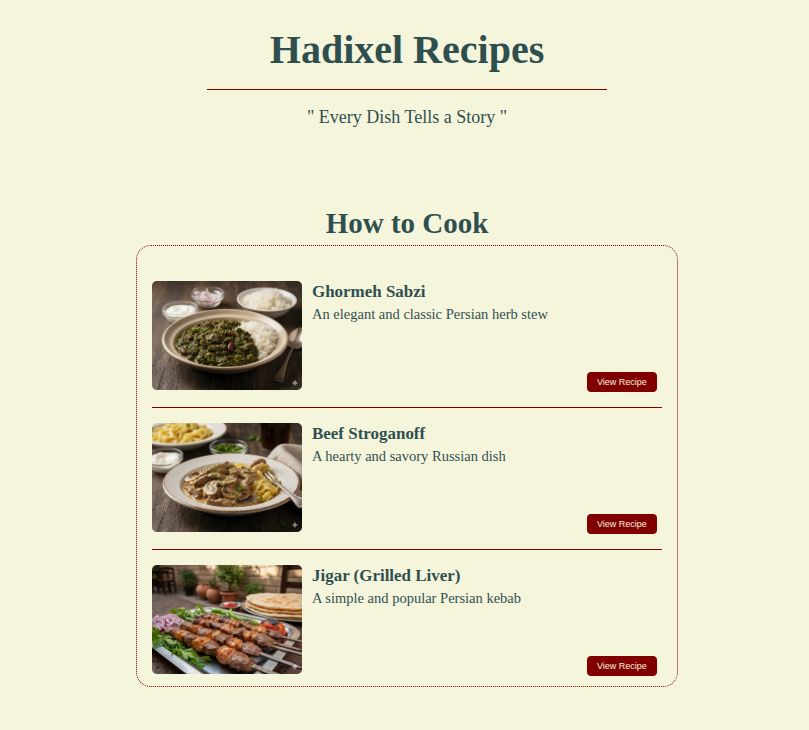

# Odin Recipes

This project is a simple recipe website built to practice and demonstrate foundational HTML skills. It was created as a core exercise in [The Odin Project's](https://www.theodinproject.com/) curriculum.

This project marks a key step in my web development journey, focusing on mastering HTML fundamentals by building a small, multi-page static site.

**Live Demo:** [View Project Here](https://github.com/Hadiasad/odin-recipes)

## Features

This website features a main index page that links to three delicious and diverse recipes.

The recipes included are:
*   **Ghormeh Sabzi:** An elegant and classic Persian herb stew.
*   **Beef Stroganoff:** A hearty and savory Russian dish.
*   **Jigar (Grilled Liver):** A simple and popular Persian kebab.

Each recipe page is structured to include:
*   An image of the final dish.
*   A brief, engaging description.
*   A semantic list of ingredients (`<ul>`).
*   Step-by-step preparation instructions in an ordered list (`<ol>`).

## Technologies Used

This project was built entirely with:

*   **Semantic HTML5:** To structure the content in a meaningful, accessible, and well-organized way.
*   **Git & GitHub:** For version control, project management, and deployment via GitHub Pages.

## Project Purpose & Learning Goals

The primary objective of this project was to apply theoretical HTML knowledge to a practical, hands-on exercise. By building this recipe website, I solidified my understanding of:

*   Creating a standard HTML5 boilerplate.
*   Using headings (`<h1>`, `<h2>`, etc.) and paragraphs (`
`) for textual hierarchy.
*   Implementing both unordered (`<ul>`) and ordered (`<ol>`) lists.
*   Embedding images (``) with appropriate attributes (`src`, `alt`).
*   Structuring a simple multi-page website with clear navigation using hyperlinks (`<a>`).
*   Practicing a fundamental Git workflow: cloning, adding, committing, and pushing changes.
*   Managing and correcting the commit history when needed.

## Acknowledgements

A huge thank you to [The Odin Project](https://github.com/TheOdinProject) for providing an incredible, free, and comprehensive curriculum that empowers aspiring developers through hands-on learning.